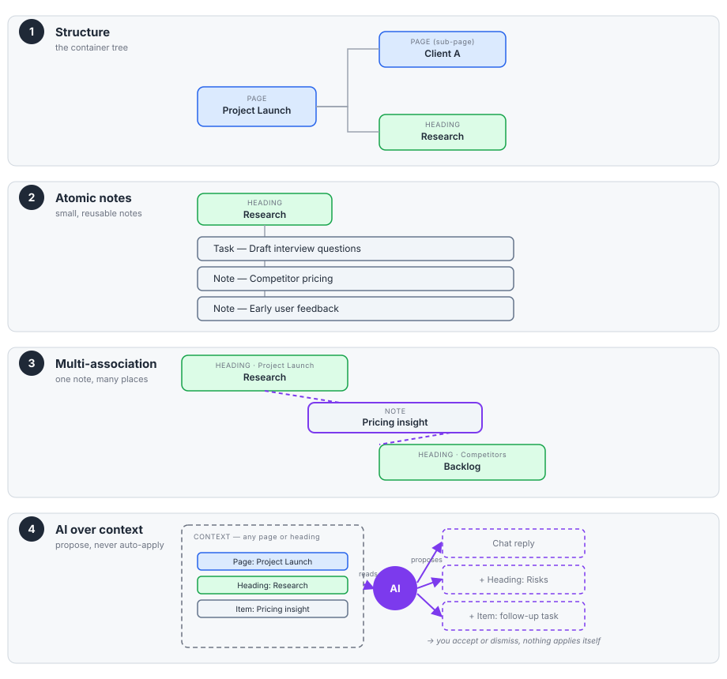
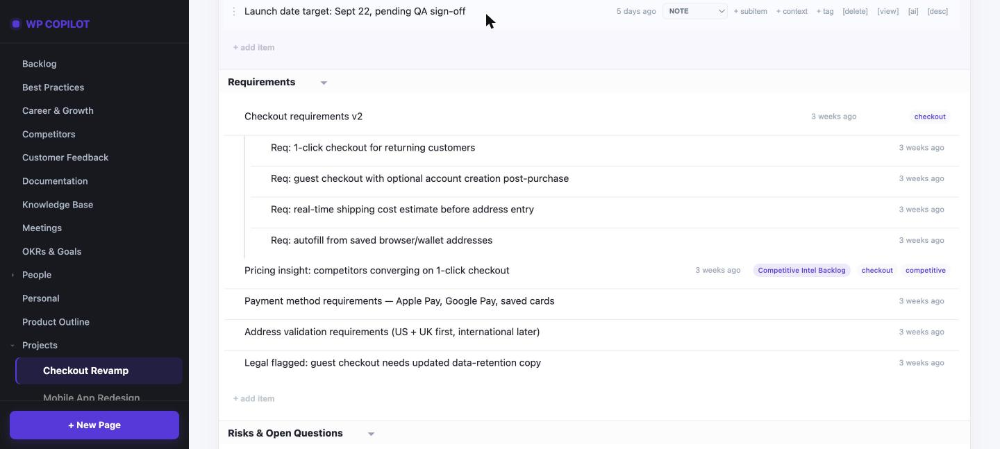
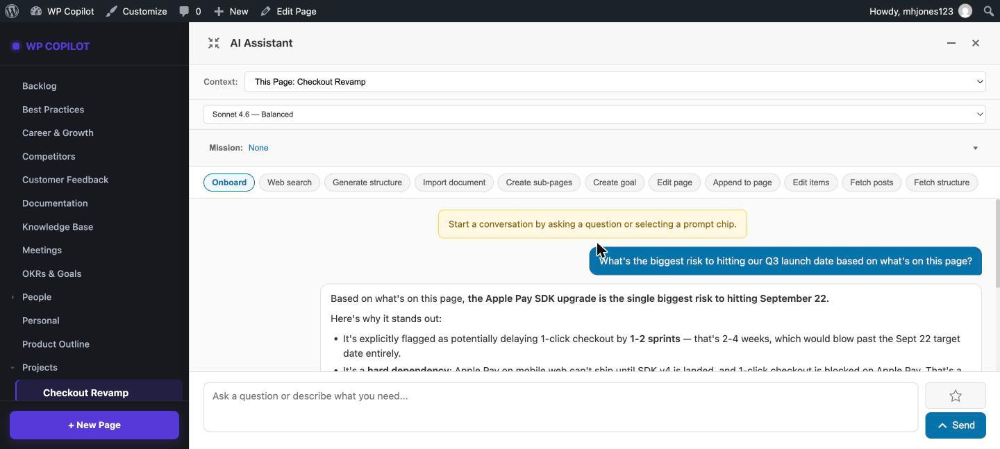
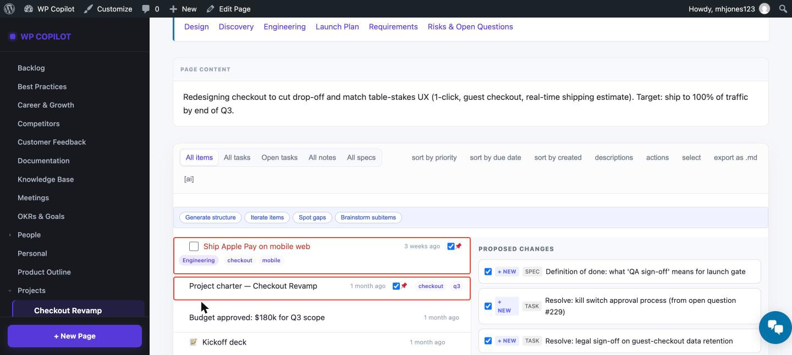
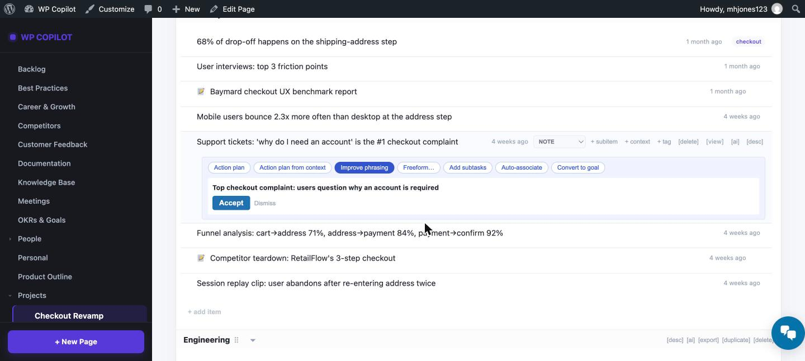

# WP Copilot

**A self-hosted WordPress application for capturing what you know and think — atomic
notes, structured context, and AI that helps you make sense of it all without ever
taking the wheel.**

WP Copilot turns a WordPress install into a personal knowledge and work system. You
capture ideas as small, reusable notes; you organise them with a structure that
doubles as meaning; and an AI assistant helps you tag, connect, summarise, and reflect
— always proposing, never acting on its own.

---

## Why WP Copilot

Most note tools force a trade-off: either rigid structure you have to maintain, or a
flat pile you can't navigate. WP Copilot takes a different stance:

- **Atomic by intent.** A note is a single idea, task, learning, or observation — small
  enough to reuse. The same note can live in many contexts at once, so you capture a
  thought once and it appears everywhere it's relevant, never duplicated.
- **Structure that doubles as meaning.** Your pages and headings aren't just navigation
  — they define the semantic scope the AI reasons within. Organising *is* teaching the
  system what things mean.
- **AI that augments, never acts.** Every AI action is explicitly invoked. The AI never
  changes your data on its own — it proposes, and you accept or dismiss. Every AI action
  is logged and auditable.
- **Native WordPress, self-hosted, yours.** Built on native WordPress primitives (posts,
  pages, taxonomies). Your data stays on your install. No third-party service owns your
  thinking.

---

## Core concepts

WP Copilot has three building blocks:

- **Pages** — contextual entities like projects, themes, people, or meetings. Nestable,
  each mapped to a semantic term. Pages define navigation and the AI's context
  boundaries.
- **Headings** — structural sub-sections within a page, for deeper organisation without
  cluttering the page tree.
- **Items (notes)** — atomic notes. A single idea, reusable across as many pages and
  headings as you like — the *same* note, not copies.

A lightweight taxonomy (type, priority, tags, pinned) lets you filter and aggregate
across everything.

---

## How it works

1. **Set up the structure.** Build a tree of Pages, sub-pages, and Headings — this is
   the container, not the content. It defines navigation *and* the boundary the AI
   reasons within when you scope an action to it.
2. **Create atomic notes inside it.** Each note is one idea — a task, a note, a
   learning, a spec — filed under a Heading or Page.
3. **Associate notes across the structure as needed.** A note isn't locked to where you
   first put it. Attach the same note to a second Heading or Page and it appears in
   both — one real record, not a copy, so an edit in one place shows up everywhere it's
   attached.
4. **Run AI actions over whatever context you scope to.** Point the AI at the current
   page, a heading, or a hand-picked set of pages, and ask it to chat over that
   context, or to generate/suggest structure and items. It reads the scope you gave it
   and returns proposals — nothing is created, edited, or filed until you accept it.

---

## AI features

The AI is opt-in, explicit, and reviewable throughout:

- **Assisted tagging** — when editing a note, the AI can *suggest* relevant pages,
  headings, tags, type, and priority. You choose what to apply.
- **Page-scoped chat** — "chat to" a page to summarise it, surface what matters, or
  review what you've added recently — scoped to just that context.
- **Preset prompts** — coaching and generation prompts that turn context into *proposed*
  notes.
- **Acceptance flow** — every AI output appears as a candidate you accept or dismiss.
  Accepted notes inherit their context and are marked AI-generated.
- **Full auditability** — every AI action records the model, prompt, input context, and
  output, retained even if you dismiss the result.

<strong>Feature set in more detail:</strong>

- **Structure generation** — turn a rough brief into a proposed set of pages/headings/
  items; import a Markdown document and split it into structure automatically.
- **Item-level actions** — action plans (as sub-item or subtask output), "improve
  phrasing," free-form instructions, auto-context suggestions, convert an item into a
  full goal.
- **Bulk editing** — describe a change across multiple items/pages at once as a
  reviewable diff, rather than editing one at a time.
- **Web search & reference gathering** — search the web for sources relevant to a
  topic, review an editable search query before it runs, and file accepted results as
  items with provenance (source URL/domain).
- **Goal creation & delegation** — turn a proposal into a tracked goal; optionally hand
  a task to an external agent (off by default) and review its report/artifacts when it
  returns.

---

## In practice

The screenshots below are all from one worked example — a product manager's Checkout
Revamp project — so you can see how structure, atomic items, and AI actions connect in
a single real page rather than four disconnected features.

**Structure down to the atom** — a Heading ("Requirements", nested under the *Checkout
Revamp* Page) with its own `[ai]` / `[export]` actions, a `spec` item broken into four
**subitems** so each requirement can move through review independently, and a note
carrying a second context pill (*Competitive Intel Backlog*) — the same note, filed
under a completely different Page, not a copy.

**Chat, grounded in the page** — asking "what's the biggest risk to hitting our Q3
launch date?" returns an answer reasoned from what's actually on this page — the Apple
Pay SDK dependency, the QA capacity crunch, the still-open legal question — not a
generic answer. Any reply can be saved as an item with one click.

**Suggest what's missing, not just more of everything** — "Spot gaps" reviews every
item already on the page and proposes only what's genuinely absent: a spec for
"definition of done," and two tasks resolving points raised as open questions
elsewhere on the same page. Each suggestion is reviewed and selectively accepted, never
applied automatically.

**Improve an item, reviewed as a diff** — "Improve phrasing" rewrites a single item's
title and content and shows the result as an explicit before/after. The original stays
untouched until you accept it.

Chips available in the chat panel:

| Chip | What it does |
|---|---|
| **Onboard** | Greets you on the page and, if it has no stated mission yet, suggests one based on its existing content — offered, not saved, until you accept it. |
| **Web search** | Searches the web for the current topic and returns candidate results as reviewable items. |
| **Generate structure** | Turns a rough brief into a proposed set of Pages/Headings/Items for you to review and selectively create. |
| **Import document** | Opens a file picker for a Markdown document and splits it into proposed structure automatically. |
| **Import PDF reference** | Opens a file picker for a PDF, extracts and summarises it into a `reference`-type item with source provenance. |
| **Create sub-pages** | Proposes child Pages nested under the current one. |
| **Create goal** | Turns the current context into a tracked goal with a proposed set of action items. |
| **Edit page** | Proposes a rewritten version of the page's content — shown as a diff to accept, not applied directly. |
| **Append to page** | Proposes new content to add to the end of the page, rather than rewriting what's there. |
| **Edit items** | Describes a change to make across multiple items on the page at once, returned as a reviewable diff instead of one-by-one edits. |
| **Fetch posts** | Pulls relevant existing posts into the conversation as context. |
| **Suggested topics** | Proposes sub-topics or sub-questions worth covering on this page. |
| **Identify gaps** | Reviews the page's existing Headings/Items and flags missing coverage. |
| **Find references** | Searches the web for sources on a topic and files accepted results as items with source URL/domain attached. |

Every one of these — like every AI action in WP Copilot — is logged with its prompt,
input context, and output, whether you accept or dismiss the result.

## Installation

**Requirements**
- WordPress 6.3+
- PHP 7.4+
- An Anthropic (Claude) API key, for AI features — optional; the plugin is fully usable
  without one

**Steps**
1. Download the latest release (or clone this repo) into `wp-content/plugins/work-copilot`.
2. Activate **WP Copilot** in your WordPress admin under Plugins.
3. Go to WP Copilot → Settings to add your Anthropic API key (optional — enables AI
   features).
4. Start creating Pages and Items — no further setup is required.

See `ENABLE-AI-SUMMARY.md` and `QUICK-START.md` for further setup detail.

**Single-admin installs only.** WP Copilot is designed and tested for one
Administrator on a dedicated install — not a firm technical restriction, but the
security model the plugin is built around. Its REST API is gated by WordPress's
standard, site-wide content capabilities rather than per-plugin permissions, so
running it on a site with other user accounts is unsupported: those accounts may be
able to reach WP Copilot's functions and content in ways the plugin doesn't attempt
to isolate. See `wp-copilot/readme.txt` → "Requirements & Supported Setup" for detail.

---

## Privacy & control

- Self-hosted: your notes live on your WordPress install.
- The AI is only ever called when you explicitly invoke it — nothing is sent on a
  schedule or in the background.
- AI never mutates your data — it proposes; you decide.
- When you use the AI assistant, the text you type plus a bounded "context pack"
  (titles/content of the Pages, Headings, and Items you're working on) is sent to
  Anthropic's Claude API. Two further integrations are optional and off by default:
  OpenAI (only if you enable semantic search/embeddings) and Raindrop.io (only if you
  enable bookmark import — outbound token only, no WordPress content leaves your site
  for this one). Full detail: see `wp-copilot/readme.txt` → "External Services".
- WP Copilot does not cap or rate-limit AI API usage. Every AI action spends your own
  configured API key's credit; you (or anyone with access to your admin account) are
  responsible for monitoring usage against your provider's billing.

---

## Status

WP Copilot is at version 1.2.2, actively maintained. Feedback and issues are welcome
via the Issues tab.

---

## License

GPL-2.0-or-later — see [LICENSE](LICENSE).
